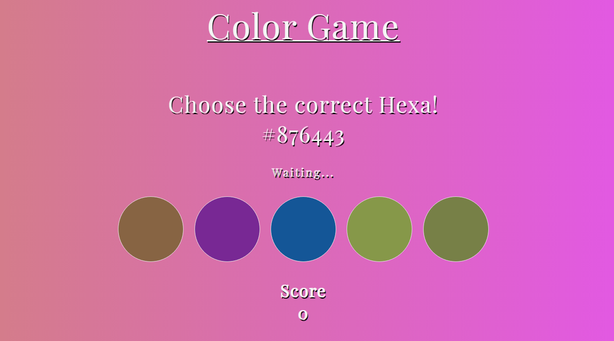

 
  

  &#xa0;

<h1 align="center">ColorGame</h1>

    Just a funny game to test your skills in hexadecimal colors.

  <a href="#dart-about">About</a> &#xa0; | &#xa0; 
  <a href="#rocket-technologies">Technologies</a> &#xa0; | &#xa0;
  <a href="#memo-license">License</a> &#xa0; | &#xa0;
  <a href="https://github.com/https://github.com/LuKezLima" target="_blank">Lucas De Lima Passos</a>

 

## :dart: About ##

I made this game because i wanted to learn and practice more my Javascript skills, the application is full responsive to all the devices. How the game works: Basicly its generate a random color in the format hexadecimal and you have to match it with the correspent color in the circles. If you match the correct color then you will see the message "Got it!" in your screen, otherwise you will see the message "Wrong.. :(". I hope you enjoy it...

## :rocket: Technologies ##

The following tools were used in this project:

- [HTML]()
- [CSS]()
- [Javascript]()

## :memo: License ##

This project is under license from Lucas Passos.

Made with :heart: by <a href="https://github.com/LuKezLima" target="_blank">Lucas De Lima Passos</a>

&#xa0;

<a href="#top">Back to top</a>
